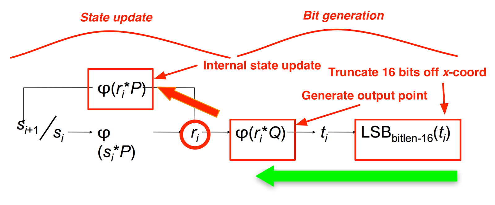

# Project -  Analysis, state and seed recovery of RNGs
## Abstract
Study of (novel) methods for seed and state recovery using reduced number of outputs for general purpose random number generators like MT19937, MT19937-64, LCGs Truncated LCGs, LSFRs, using SMT/SAT solvers.

## Introduction
Given a PRNG algorithm $A$, which is initialised using an initial value aka `seed` and $x_1, x_2, ..., x_k$ be the generated outputs from the random number generator, we wish to determine the starting `seed` or the state $S$ required to predict the future outputs of the generator.

We were able to recover `seed` of standard mersenne twister (MT19937), which is the most used PRNG across all software systems, using only **3** outputs using SMT solvers in under 5 minutes, whereas all previous work is on state recovery using *624 consecutive outputs*.

We also employed SMT solvers to recover the state of other well known PRNGs like LCG, LSFRs and combiner generators using a set of LSFRs.

We aim to understand the predictability of PRNGs and further analysed the design of some cryptographically secure PRNGs and case study of the notorious DUAL_EC_DRBG CSPRNG for presence of a kleptographic backdoor to give NSA ability to predict all outputs.

# Table of Contents
1. [Mersenne Twister](#mersenne-twister)
2. [LFSR](#LFSR)
3. [LCG](#LCG)
4. [Case Study: Dual_EC_DRBG](#Dual_EC_DRBG)

# Mersenne Twister

## Mersenne Twister (19937)
Mersenne Twister is by far the most widely used general-purpose PRNG, which derives its name from the fact that its period is the mersenne prime $2^{19937} -1$  

It is the default PRNG in Dyalog APL, Microsoft Excel, GAUSS, GLib, GNU Multiple Precision Arithmetic Library, GNU Octave, GNU Scientific Library, gretl, IDL, Julia,CMU Common Lisp, Embeddable Common Lisp, Steel Bank Common Lisp, Maple,MATLAB, Free Pascal, PHP, Python,R,Ruby,SageMath, Scilab, Stata, SPSS, SAS, Apache Commons,  standard C++ (since C++11), Mathematica. Add-on implementations are provided in many program libraries, including the Boost C++ Libraries, the CUDA Library, and the NAG Numerical Library.

### Algorithmic Details
The Mersenne Twister algorithm is based on a matrix linear recurrence over a finite binary field $F_2$. The algorithm is a twisted generalised feedback shift register (twisted GFSR, or TGFSR) of rational normal form, with state bit reflection and tempering. 

The internal state is defined by a sequence of $n=624$, 32-bit registers ($w$)  

$$x_{k+n} \to x_{k+m} \oplus (( x_k^{u} \| x_{k+1}^{l})A)$$
To compensate for reduced dimensionality of equidistribution, the state is cascaded with tampering transform (to improve the equidistribution) to produce the output

$$y \to x \oplus(( x >> u)\&d)$$
$$y \to y \oplus(( y << s)\&b)$$
$$y \to y \oplus(( y << t)\&c)$$
$$z \to y \oplus( y >> l)$$

The computed $z$ is returned by the algorithm
where the choice of constants is as follows
```
(w, n, m, r) = (32, 624, 397, 31)
a = 0x9908B0DF
(u, d) = (11, 0xFFFFFFFF)
(s, b) = (7, 0x9D2C5680)
(t, c) = (15, 0xEFC60000)
l = 18
f = 1812433253 
```

### Initialization
The state needed for a Mersenne Twister implementation is an array of $n$ values of $w$ bits each. To initialize the array, a w-bit seed value is used to supply $x_0$ through $x_{n-1}$ by setting $x_0$ to the seed value and thereafter setting

$$x_i = f \times (x_{i-1} \oplus (x_{i-1} >> (w-2))) + i$$

for $i$ from 1 to n-1. The first value the algorithm then generates is based on $x_n$


While implementing, we need to consider only three things
1. State initialization i.e. seeding
2. The `twist` operation to produce next 624 state registers by "twisting" the current state of 624 registers
3. The `tamper` operation to tamper a state register to the produced 32-bit output

## Background
There exist various conference talks for mersenne twister seed and state recovery for the aid of pentesters at various security conferences e.g
- [untwister](https://github.com/bishopfox/untwister) presented at B-Sides Las Vegas 2014, which recovers upto 32 bit seeds by a parallalized bruteforce using a pool of workers or state recovery using 624 consecutive outputs (will be discussed soon).  
- [PRNG Cracker](https://dspace.cvut.cz/bitstream/handle/10467/69409/F8-BP-2017-Molnar-Richard-thesis.pdf?sequence=-1&isAllowed=y) which in addition to parallalized seed bruteforcing, creates a rainbow table of outputs for lookup in seed database.
- [PHP mt_rand predictor](https://www.ambionics.io/blog/php-mt-rand-prediction) achieves seed recover using two outputs which are 227 apart of each other exploiting the improper implementation of mersenne twister in PHP in particular. This works only for PHP as it doesnt use the standard MT algorithm.

### State recovery from 624 consecutive outputs
The mersenne twister keeps a state of 624 registers `MT` and an index `i` to track the position in the state. Once `i` reaches the end of state array, the `twist` operation is called to twist the state to next 624 numbers in the sequence and `i` is set to 0. The output $y_i$ is generated using the `tamper` function on the state `MT[i]`. This tamper function is completely reversible, hence given $y_i$ we can recover `MT[i]`. Once we recover any 624 state registers, we can set $i=0$ from there and predict any future outputs.

#### Untamper
Each of the step of instructions in `tamper` is reversible since it is simple xor of a register and right or left shifted select bits of it. Merely tracking which bits were xored with which bits of the input register to get the next value, we can undo the operation. Since in xoring with right shifting, the MSB of y would be MSB of x, and in xoring with left shifting, the LSB of y will be LSB of x.
```
y = undo_right_shift_xor_and(z, l)
y = undo_left_shift_xor_and(y, t, c)
y = undo_left_shift_xor_and(y, s, b)
x = undo_right_shift_xor_and(y, u, d)
```

## Our work
We began with the implementation of standard MT19937 from algorithm described on [Wikipedia](https://en.wikipedia.org/wiki/Mersenne_Twister). This involved a lot of debugging and testing against various random number library implementations, reading the source code of the MT implementations in Python, Ruby, PHP. And figuring out how each of these vary from the standard implementation on wiki. 

### Modelling
We modelled the seed recovery algorithm as a SMT problem using the SMT solver [Z3Prover](https://github.com/Z3Prover/z3), as a sequential program written in theory of BitVectors(32) (since the algorithm is designed to work on 32bit architectures) and theory of BitVectors(64) for MT19937-64 . After (painfully) modelling the program, we begin a SAT solver search (all-SAT to give all satisfying models for possible seed values) which leads us to a given sequence of outputs (the generated random numbers). 

### Results
We were able to recover the seed of the mersenne twister for both MT19937 and MT19937-64 using any **3** consecutive outputs, in about ~200 seconds.  

The modelling of `untwist` can reverse the `twist` operation to go back 624 outputs, which cannot be done easily by any of usual methods thus enabling us to predict unseen outputs which were produced before the observed set of outputs.  

Our method is extremely memory and space efficient since SAT solvers work with negligible memory (<500 MB). And way faster and efficient considering the space time tradeoff involved.

The same methodology is applicable and extendible to various other cases where it might not be possible at all to come up with an angle of attack. For example.
- Outputs of non-32 bit sizes, say `random.gerandbits(31)` is called
- One of the most used methods from random library is usually `rand` which generates a random float in 0 to 1 (which internally makes two MT calls and throws away 11 bits to generate the random number)
- `random.randrange(1,n)` is called which may internally make use of multiple MT calls.

All of the various methods from random libraries can be used to recover the state/seed whereas all other approaches merely work if only we have 624 consecutive `random.getrandbits(32)` calls which is quite rare to observe in a real life application.

## Challenges
While the wikipedia implementation is treated as the standard mersenne twister, we found that our implementation was producing different outputs from the implementations in programming languages even after initializing by the same seed. After dissecting a lot of source code, we figured out that the wiki implementation serves as the base of merssene twister implementation everywhere with a difference in the way it is seeded. All modern mersenne twister are seeded with a function `init_by_array` which takes an array of 32-bit seeds (or 32 bit hashes of seed objects). Later we found that this was proposed as an enhancement to equidistribution property to the base mersenne twister [MT2002](http://www.math.sci.hiroshima-u.ac.jp/m-mat/MT/MT2002/emt19937ar.html).  
This `init_by_array` is much more non-linear that the standard `seed_mt` operation and makes it much more difficult to recover the seed values from a few outputs. We tried following the same approach, and it turns out it was unable to deduce the seed even in a couple of hours. 

Yet another major challenge was to understand the exact API and studying what exactly to use.  
e.g `BitVec` class of z3 assumes the bitvector to be signed. Consequently, we will need to define the `>>` the shift right operator as either logical shift right (`z3.LShR`) or arithmetic shift right (which is `>>` the `__rshift__` magic method in `BitVec` class). Mistakably using `>>` to shift right logically, costed us a lot of debugging time and a lot of `unsat` examples, which were quite hard to figure out due to the unsuspecting sign of things.

## Limitations
The most basic limitation of seed/state recovery using SMT/SAT solvers is figuring out the time complexity and approximate time required to find a satisfying assignment of our choice. While researching, it is almost like running through a jungle as we never know how much time it would take us to find a way.  
The time required to find a satisfying assignment is also very dependent on the way the problem was encoded. Seemingly similar modelling/encoding can end up in drastically different run times as the solver may end up using completely different heuristics and paths to find a goal. So the major drawback is finding out the best way or a good enough way to recover the seeds of a given PRNG algorithm.  

Other drawback of our approach is that SMT solvers operate in the realm of first order logic. If a given algorithm can not be encoded in FOL, SMT solver wont be able to find a satisfying assignment (though all the work we did can be translated easily under FOL).

Another drawback can be when there are more than one possible seed/state to produce a given set of outputs, SAT solvers are designed and optimized to find a single satisfying assignment, finding successive assignments, may or may not translate equivalently.

Yet another drawback is lack of parallelism. The current design of SAT/SMT solvers is massively single threaded and may not use the full capabilities and cores of the machine to find a satisfying assignment.


## References
- [The Mersenne Twister](http://www.quadibloc.com/crypto/co4814.htm)
- [Wikipedia](https://en.wikipedia.org/wiki/Mersenne_Twister)

# LFSR

## Background
Previous work done in this topic

## Our Work
Exactly what we did (setup up something, installed something, ran code from github etc. whatever small things we did for the project)

## Challenges / Difficulties


## Limitations / Assumptions


## Compatibility issues
Could not run a particular version of software or a software didn't worked in a particular os

## Understanding existing papers
sir ka example -> this particular paper was very cryptic and there were a lot of notions and after enormous discussion it took us 1 week to understand 

## Reading manual


## Critique / Comparison
Critique an idea or paper or an attack senario
Comparison with others work or idea

## Extensions


# Linear Congruential Generator

Linear Congruential Generator(LCG) is a method of generating a sequence of pseudo-randomized numbers calculated using modular arithmetic. This method has seen quite widespread usage since the theory behind this method is pretty easy to understand and is also easy to implement as well as fast and require minimal memory, especially on computer hardware.

However, LCG is not cryptographically secure. Moreover, they have been shown to be not so good even for [Monte-Carlo simulations](https://en.wikipedia.org/wiki/Marsaglia%27s_theorem) due to correlation between successive values. 

<!-- mention Truncated lcg -->

### Details
Linear Congruential Generator is defined by the following recurrence relation - $$X_{i+1} = (a*X_i + b) % m$$
where $X$ is the sequence of generated pseudo-random values; $m$ is the `modulus`, $a$ is the `multiplier`, $c$ is the `increment` and $X_0$ is the `seed` or the `start value`. 
 
Note that the above mentioned update applies not just to the generated values but also to the internal state; ie, whenever a call is made to the LCG, $X_{i+1}$ is yielded as well as the internal state is updated to $X_{i+1}$.

## Background
It has been shown that given sufficient number of outputs, one could recover the internal state even if the parameters of the generator - $a$,$c$ and $m$ are unknown. 

## Our Work
The existing method indeed allows us to recover the internal state given just a few outputs, and the probability of the attack succeeding increases with increase in the number of outputs chosen.

[Z3Prover](https://github.com/Z3Prover/z3) has also been used to recover the internal state, but it relies on the knowledge of the parameters, and works well only when $m$ is a power of $2$.


## References
- [LCG](https://en.wikipedia.org/wiki/Linear_congruential_generator)
- [Marsaglia's Theorem](https://en.wikipedia.org/wiki/Marsaglia%27s_theorem)


# Dual EC DRBG - Kleptographic Backdoor

Dual EC(Elliptic Curve) DRBG(Deterministic Random Bit Generator) was a pseudo-random number generator which was a one of its kind of PRNGS in that it relied on elliptic curves, while most earlier PRNGs relied on symmetric components like block ciphers or hash functions. As a result, it was quite slow than it's competitive RNGs. However, since it was based on elliptic curves, it was believed that this was a **Cryptographically Secure** PRNG; however it later turned out that it suffered from many flaws. Despite all its shortcomings, it was highly standardized by NSA and was one of the four PRNGs proposed by NIST as **approved CSRNGs**.

### Working



A particular curve $C$ and two points on the curve $P$ and $Q$ are chosen apriori and remain fixed throughout.

The RNG is initially seeded with a random seed $s_0$. Whenever the RNG is asked for an output, assuming that the current seed(state) is $s_i$; $r_i \leftarrow (s_i * P) |_{x}$ is computed where $M |_{x}$ denotes the $x$-coordinate of the point $M$.

The seed is then updated as $s_{i+1} \leftarrow (r_i * P) |_{x}$, $t_i$ is computed as $t_i \leftarrow (r_i * Q) |_{x}$ and then the output generated is $LSB_{bitlen - 16}(t_i)$ where $LSB_{k}$ denotes the Least Significant $k$ bits.

We work with the case where $C$ is the NIST $P-256$ curve, in which case $bitlen = 256$ and therefore, in a single round, $240$ bits are obtained.


### Backdoor

Since the RNG only throws out the top $16$ bits, which is a very small amount compared to the total bit-length being $256$, these $16$ bits can be bruteforced to obtain list of points on the curve admitting the mentioned `240` least significant bits ensure. This would usually be the end of any possible attack, however this RNG had another issue!  

If $P$ and $Q$ were chosen to be totally random points, being able to deduce $r_i * Q$ doesn't help us in recovering the internal state at all. However, if $P$ and $Q$ were deliberately chosen such that $Q = e*P$ or $P = d * Q$; given the generated point $r_i * Q$, one could obtain the next state by computing the internal point as $r_i * P = r_i * d * Q = (r_i * Q) * d$. This not only compromises the security of the RNG, but also allows the attacker to be able to predict all future outputs of the RNG.

## Background

It was [shown](https://eprint.iacr.org/2006/190.pdf) that the generated `240` bits are not indistinguishable from truly random bits but actually and admit non-negligible bias; thus demonstrating that the generator is insecure! Even though [some papers](https://eprint.iacr.org/2007/048) tried to show that DEC-DRBG was based on `cryptographically hard` problems; the possibility of a [kleptographic backdoor](https://rump2007.cr.yp.to/15-shumow.pdf) was later demonstrated. With this backdoor, one could essentially break down TLS just by monitoring one encryption connection.

## Our Work

In our Proof-of-Concept, we demonstrate that choosing $P$ and $Q$ of our own accord allows us to recover the internal state of the RNG in mere 32 bytes(atmost 256 bits) of output. This confirms the possibility of there being a backdoor in the RNG, and hence, allowing the attacker to compromise encryptions based which relied on Dual-EC-DRBG.

## Challenges/Difficulties

How to perform mathematical operations on elliptic curves efficiently in python was one of the small challenges we encountered.  
Another challenge is that one can not demonstrate the backdoor on the original values of $P$ and $Q$ chosen by the implementation, since it's extremely hard to obtain any relation between $P$ and $Q$ without it being provided.

## Assumptions

We demonstrated the backdoor by choosing our own random `multiplicative relation` between the "random points" $P$ and $Q$.

## Critique/Comparison

If only one output(`240` bits) can be obtained from the RNG, $~2^15$ possible states exist; thus, the attack doesn't work in such a case(atleast around `256` bits need to be seen, which essentially means two outputs from the RNG).

The values of $P$ and $Q$ which were used in the actual implementation had been publicised by NSA/NIST to be the ones which allowed "fast computations", nobody knows where these values actually came from! Since the values were chosen by themselves, it is unknown whether they actually had utilized this backdoor but the existence of a backdoor in a popular PRNG is very troublesome to the cryptographic community in itself.

# Team members
1. Himanshu Sheoran 170050105
2. Lakshya Kumar 170050033
3. Sahil Jain 180050089
4. Yash Ajitbhai Parmar 170050004
