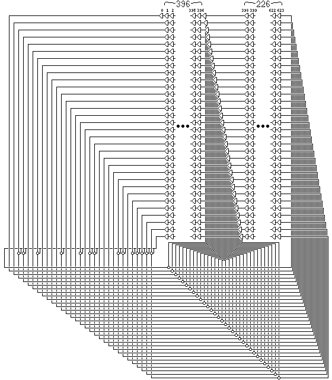

## Introduction

### Mersenne Twister (19937)
Mersenne Twister is by far the most widely used general-purpose PRNG, which derives its name from the fact that its period is the mersenne prime $2^{19937} -1$  

It is the default PRNG in Dyalog APL, Microsoft Excel, GAUSS, GLib, GNU Multiple Precision Arithmetic Library, GNU Octave, GNU Scientific Library, gretl, IDL, Julia,CMU Common Lisp, Embeddable Common Lisp, Steel Bank Common Lisp, Maple,MATLAB, Free Pascal, PHP, Python,R,Ruby,SageMath, Scilab, Stata, SPSS, SAS, Apache Commons,  standard C++ (since C++11), Mathematica. Add-on implementations are provided in many program libraries, including the Boost C++ Libraries, the CUDA Library, and the NAG Numerical Library.

#### Algorithmic Details
The Mersenne Twister algorithm is based on a matrix linear recurrence over a finite binary field $F_2$. The algorithm is a twisted generalised feedback shift register (twisted GFSR, or TGFSR) of rational normal form, with state bit reflection and tempering. 

The internal state is defined by a sequence of $n=624$, 32-bit registers ($w$)  

$$x_{k+n} \to x_{k+m} \oplus (( x_k^{u} \| x_{k+1}^{l})A)$$
To compensate for reduced dimensionality of equidistribution, the state is cascaded with tampering transform (to improve the equidistribution) to produce the output

$$y \to x \oplus(( x >> u)\&d)$$
$$y \to y \oplus(( x << s)\&b)$$
$$y \to y \oplus(( x << t)\&c)$$
$$z \to y \oplus( x >> l)$$

The computed $z$ is returned by the algorithm
where the choice of constants is as follows
```
(w, n, m, r) = (32, 624, 397, 31)
a = 0x9908B0DF
(u, d) = (11, 0xFFFFFFFF)
(s, b) = (7, 0x9D2C5680)
(t, c) = (15, 0xEFC60000)
l = 18
f = 1812433253 
```

#### Initialization
The state needed for a Mersenne Twister implementation is an array of $n$ values of $w$ bits each. To initialize the array, a w-bit seed value is used to supply $x_0$ through $x_{n − 1}$ by setting $x_0$ to the seed value and thereafter setting

$$x_i = f \times (x_{i−1} \oplus (x_{i−1} >> (w−2))) + i$$

for i from 1 to n−1. The first value the algorithm then generates is based on $x_n$



While implementing, we need to consider only three things
1. State initialization i.e. seeding
2. The `twist` operation to produce next 624 state registers by "twisting" the current state of 624 registers
3. The `tamper` operation to tamper a state register to the produced 32-bit output


## References
- [The Mersenne Twister](http://www.quadibloc.com/crypto/co4814.htm)
- [Wikipedia](https://en.wikipedia.org/wiki/Mersenne_Twister)